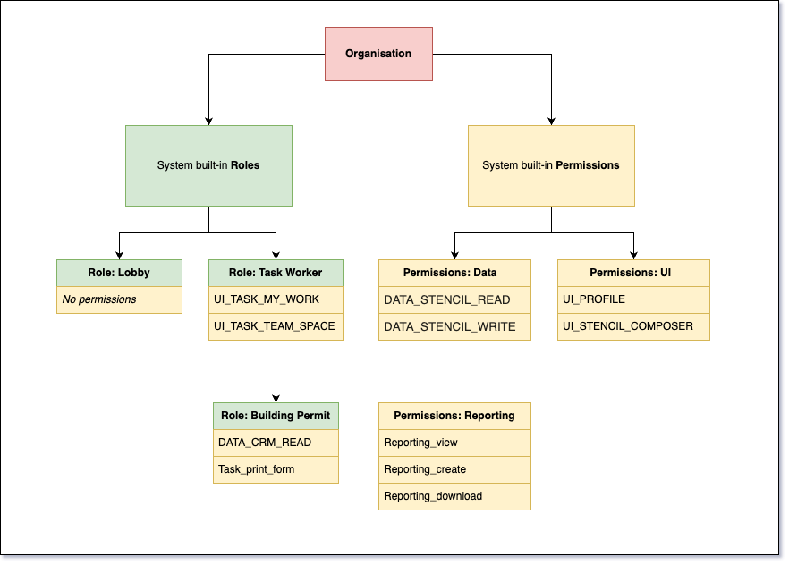

# Access Management

DigiExpress has built-in Roles and Permissions which come by default with the application.

## Built-in Roles
* **Lobby**: A Role with no Permissions used to temporarily hold newly-added Principals until an Admin can assign Roles/Permissions.
* **Task Worker**: TODO

## Built-in Permissions
* **UI Permissions** dictate what a Principal (user) can access (for example, Stencil Composer or their User Profile).  
* **DATA Permissions** dictate whether a Principal can query, read, write, or delete application data such as Tasks, Stencil content, Dialob forms, etc.

## User-created Roles and Permissions
TODO

